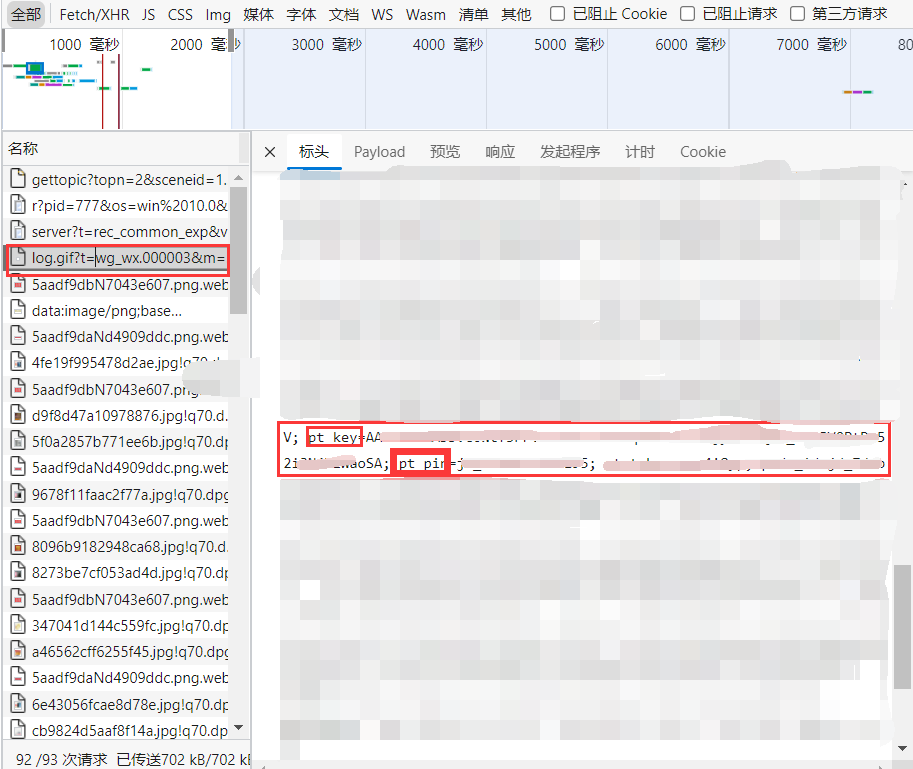
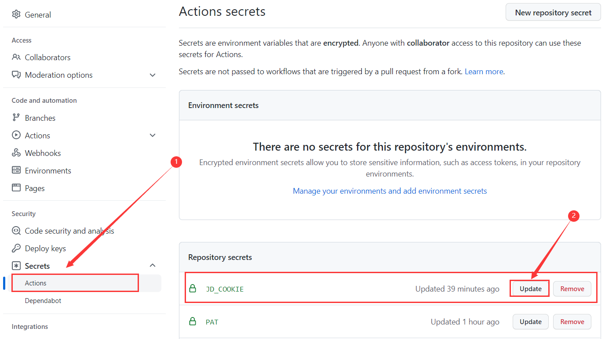
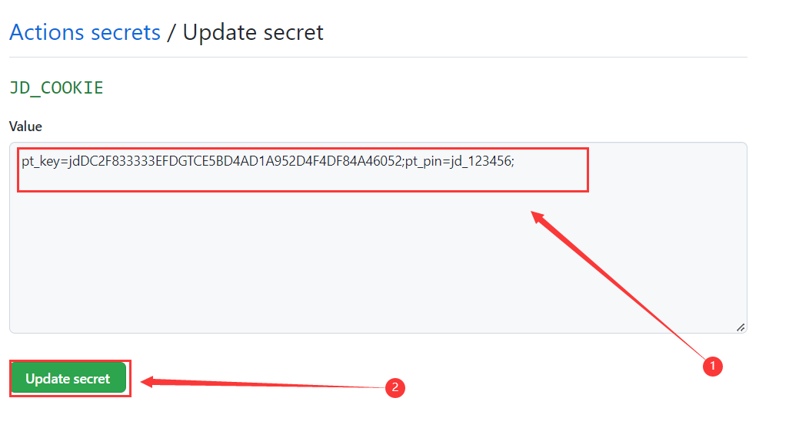

# 获取并更新京东cookie教程

## 浏览器获取京东cookie教程

 **以下浏览器都行**

 - Chrome浏览器
 - 新版Edge浏览器
 - 国产360，QQ浏览器切换到极速模式

### 操作步骤

1. 电脑浏览器打开京东网址 [https://m.jd.com/](https://m.jd.com/)

2. 按键盘F12键打开开发者工具，然后点下图中的图标
 
 
 
3. 此时是未登录状态(使用手机短信验证码登录)，如已登录请忽略此步骤
     - 使用手机短信验证码登录(此方式cookie有效时长大概31天，其他登录方式比较短)
     
4. 登录后，选择Network,有很多链接的话点箭头这里清空下
    
    
5. 然后再点我的，链接就变少了
    
    
6. 点第一个链接(log.gif)进去，找到cookie，复制出来，新建一个TXT文本临时保存一下，下面需要用到
 
 
7. 第六步复制出来的cookie比较长，我们只需要`pt_pin=xxxx;`和 `pt_key=xxxx;`部分的内容即可(注:英文引号`;`是必要的)。
    
    - `pt_key=复制插件搜索出来的key值;pt_pin=复制插件搜索出来的pin值;` ,后面的英文引号`;`是必须要的
    - 给一个京东cookie具体示例 `pt_key=jdDC2F833333EFDGTCE5BD4AD1A952D4F4DF84A46052;pt_pin=jd_123456;`
    
    
    
    也可以用下面的脚本，在Chrome浏览器按F12，console里面输入下面脚本按enter回车键
    
    ```
    var CV = '单引号里面放第六步拿到的cookie';
    var CookieValue = CV.match(/pt_pin=.+?;/) + CV.match(/pt_key=.+?;/);
    copy(CookieValue);
    ```
    
8. 这样子整理出关键的的cookie已经在你的剪贴板上， 可直接粘贴

9. 如果需获取第二个京东账号的cookie,不要在刚才的浏览器上面退出登录账号一(否则刚才获取的cookie会失效),需另外换一个浏览器(Chrome浏览器 `ctr+shift+n` 打开无痕模式也行),然后继续按上面步骤操作即可


## 浏览器插件获取京东cookie教程

 **以下浏览器都行**

 - Chrome浏览器
 - 新版Edge浏览器(chrome内核)

### 操作步骤

1. 电脑浏览器打开京东网址 [https://m.jd.com/](https://m.jd.com/)

2. Chrome类浏览器安装EditThisCookie插件
      - Chrome插件商店搜EditThisCookie, 或者[打开此网站](https://chrome.google.com/webstore/detail/editthiscookie/fngmhnnpilhplaeedifhccceomclgfbg?utm_source=chrome-ntp-icon) 进行安装
      - 仅使用百分浏览器，谷歌浏览器测试过，其他谷歌类浏览器请自行测试。
      - 无法登录Chrome插件商店或者打不开网址建议使用edge chrome版。

3. edge chrome浏览器安装Cookie Editor插件
        - [edge插件商店](edge://extensions/)搜Cookie Editor，或[打开以下网址](https://microsoftedge.microsoft.com/addons/detail/cookie-editor/ajfboaconbpkglpfanbmlfgojgndmhmc?hl=zh-CN) 完成插件安装 

4. 以下是chrome和edge的相关设置截图，输入的网址是 ``jd.com``

    

    

5. 现在点击回到京东触屏版，再点击EditThisCookie/Cookie Editor，再点击搜索，输入key或pin，如下图所示的pt_key，复制pt_key的value值。此插件可以看到cookie的有效期。

    

6. 按照以下格式形成自己的jd_cookie
      - `pt_key=复制插件搜索出来的key值;pt_pin=复制插件搜索出来的pin值;` ,后面的英文引号`;`是必须要的
      - 给一个京东cookie具体示例 `pt_key=jdDC2F833333EFDGTCE5BD4AD1A952D4F4DF84A46052;pt_pin=jd_123456;`      

7. 如果需获取第二个京东账号的cookie,不要在刚才的浏览器上面退出登录账号一(否则刚才获取的cookie会失效),需另外换一个浏览器(Chrome浏览器 `ctr+shift+n` 打开无痕模式也行),然后继续按上面步骤操作即可

# 把cookie添加到github

1.点库中的Settings


2.点击Secrets - Actions，在点击JD-COOKIE后方的Update更新



3.将复制到的值粘贴到Value下方的框中，在点击下方的Update secret即可完成



