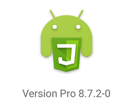
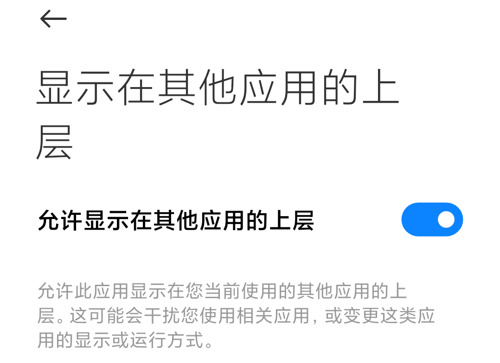
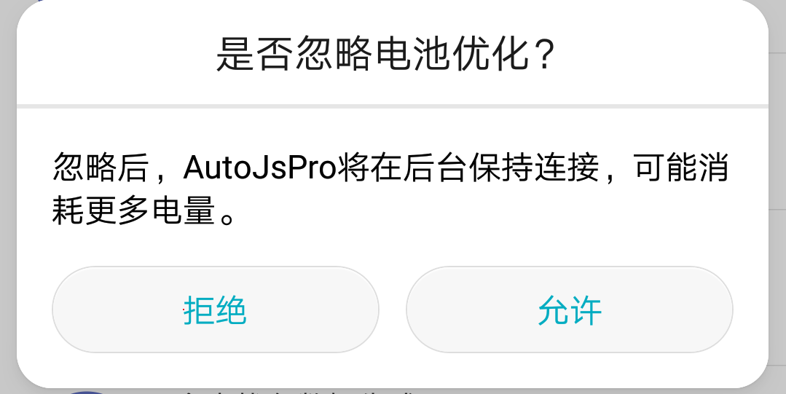
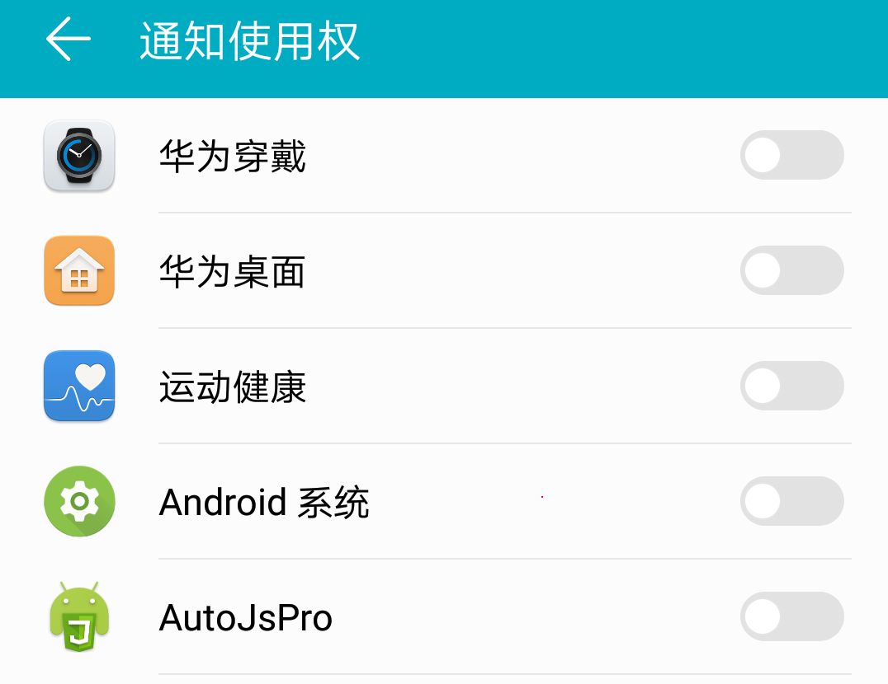

# autojs之权限设置

## 使用场景

申请各种权限, 以及一些坑

## autojs版本



## 截图权限

**申请截图代码**

```
if (!requestScreenCapture()) {
  toastLog("请求截图权限 失败");
} else {
  toastLog("请求截图权限 成功");
}
```

执行以上代码后, 正常应该弹出一个框, 让用户选择是否允许截图


但是有的时候, **不会弹出这个界面**, 这个时候,

你就要去 设置–>应用管理–>AutoJsPro–>权限管理–>后台弹出界面–>允许


## 悬浮窗权限

**判断是否有悬浮窗权限的代码**

```
floaty.checkPermission();
```

返回一个布尔值, true就是有权限, false就是没有权限

如果没有, 我们就需要提示用户, 使用app需要悬浮窗权限, 然后跳转悬浮窗权限设置界面, 方便用户勾选

**跳转悬浮窗权限设置界面代码**

```
app.startActivity({
  packageName: "com.android.settings",
  className: "com.android.settings.Settings$AppDrawOverlaySettingsActivity",
  data: "package:" + context.getPackageName(),
});
```



## 后台自启权限

以华为手机为例, 跳转启动管理页面的代码

```
let intent = new Intent();
intent.addFlags(Intent.FLAG_ACTIVITY_NEW_TASK);
let pkg = "com.huawei.systemmanager";
let cls = "com.huawei.systemmanager.startupmgr.ui.StartupNormalAppListActivity";
let componentName = new android.content.ComponentName(pkg, cls);
intent.setComponent(componentName);
context.startActivity(intent);
```

## 下面的权限列表

- 后台弹出界面权限
- 忽略电池优化权限
- 可修改系统设置权限
- 通知使用权限
- 无障碍权限
- GPS是否为打开状态
- 申请普通权限
- 调用摄像头权限
- 申请权限回调
- 跳转应用信息页

## 后台弹出界面权限

以小米手机为例, 判断是否有**后台弹出界面**权限的代码

```
function checkOp(ctx, op) {
  try {
    return ctx.getSystemService("appops").checkOp(op, android.os.Binder.getCallingUid(), ctx.getPackageName()) == 0; //MODE_ALLOWED
  } catch (e) {
    log(e);
  }
  return false;
}

let op = 10021; // >= 23
let r = checkOp(context, op);
log(r);
// true 有权限 false 没有权限
```

## 忽略电池优化权限

以华为手机为例, 判断是否在忽略电池优化白名单中

```
function isIgnoringBatteryOptimizations() {
  return context
    .getSystemService(android.content.Context.POWER_SERVICE)
    .isIgnoringBatteryOptimizations(context.packageName);
}
// true 在白名单中 false 不在白名单中
```

以华为手机为例, 弹框是否忽略电池优化

```
app.startActivity(
  new android.content.Intent()
    .setAction(android.provider.Settings.ACTION_REQUEST_IGNORE_BATTERY_OPTIMIZATIONS)
    .setData(android.net.Uri.parse("package:" + context.packageName))
);
```



## 可修改系统设置权限

以华为手机为例,(若无特殊说明, 均为华为手机, 不一定所有华为手机都一样, 仅供参考)

是否有可修改系统设置权限

```
android.provider.Settings.System.canWrite(context)
```

跳转到可修改系统设置权限页面

```
app.startActivity(
  new Intent(
    android.provider.Settings.ACTION_MANAGE_WRITE_SETTINGS,
    app.parseUri("package:" + context.getPackageName())
  )
);
```

## 通知使用权限



是否有通知使用权限

```
function notificationListenerEnable() {
  let packageName = context.getPackageName();
  let data = android.provider.Settings.Secure.getString(context.getContentResolver(), "enabled_notification_listeners");
  if (data != null) {
    let enable = data.indexOf(packageName);
    if (enable != -1) {
      return true;
    } else {
      return false;
    }
  }
}
// true 有通知使用权 false 没有通知使用权
```

## 无障碍权限

是否有无障碍权限

```
auto.service == null
// true 没有无障碍权限 false 有无障碍权限
```

跳转无障碍页面

```
app.startActivity({
  action: "android.settings.ACCESSIBILITY_SETTINGS",
});
```

## GPS是否为打开状态

判断GPS是否已经打开

```
var ls = context.getSystemService(context.LOCATION_SERVICE);
if (ls.isProviderEnabled(android.location.LocationManager.GPS_PROVIDER)) {
  console.log("GPS已打开");
}
```

跳转到GPS设置页面

```
app.startActivity({
  action: "android.settings.LOCATION_SOURCE_SETTINGS",
});
```

## 申请普通权限

```
runtime.requestPermissions([
  "access_fine_location",
  "access_network_state",
  "access_notification_policy",
  "body_sensors",
  "broadcast_sticky",
  "camera",
  "change_network_state",
  "expand_status_bar",
  "foreground_service",
  "get_accounts",
  "get_package_size",
  "install_location_provider",
  "install_packages",
  "install_shortcut",
  "internal_system_window",
  "internet",
  "kill_background_processes",
  "manage_accounts",
  "manage_app_tokens",
  "master_clear",
  "modify_audio_settings",
  "mtweak_forum",
  "mtweak_user",
  "persistent_activity",
  "process_outgoing_calls",
  "read_calendar",
  "read_call_log",
  "read_cell_broadcasts",
  "read_contacts",
  "read_external_storage",
  "read_phone_state",
  "read_sms",
  "read_sync_settings",
  "receive_boot_completed",
  "receive_mms",
  "receive_sms",
  "record_audio",
  "reorder_tasks",
  "request_install_packages",
  "restart_packages",
  "set_alarm",
  "set_debug_app",
  "set_time",
  "system_alert_window",
  "write_calendar",
  "write_call_log",
  "write_contacts",
  "write_external_storage",
  "write_sync_settings",
]);
```

## 调用摄像头权限

是否有调用摄像头权限

```
let permissionName = "camera";
let pm = context.getPackageManager().checkPermission("android.permission.CAMERA", context.getPackageName());
let r = android.content.pm.PackageManager.PERMISSION_GRANTED == pm;
log(r);
// true 有权限 false 没有权限
```

申请调用摄像头方法一

```
let permissionName = "camera";
runtime.requestPermissions([permissionName]);
```

由于方法一触发不了**request_permission_result**事件

我们使用方法二申请摄像头权限

申请权限后, **判断用户是否授予权限**

```
ui.emitter.on("request_permission_result", function () {
  toastLog(arguments); // { '0': 100, '1': [android.permission.CAMERA], '2': [-1] } 
  // java 对应的方法 
  // onRequestPermissionsResult(int requestCode, @NonNull String[] permissions, @NonNull int[] grantResults)
});
androidx.core.app.ActivityCompat.requestPermissions(activity, ["android.permission.CAMERA"], 100);
```

## 跳转应用信息页

```
app.openAppSetting(context.packageName);
```