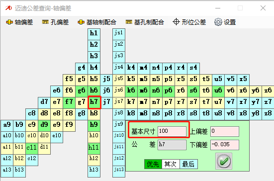
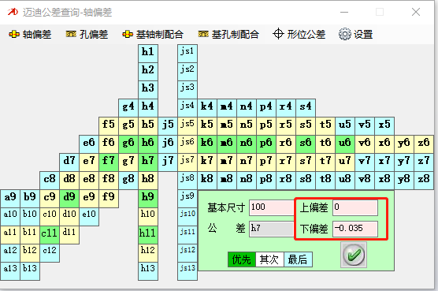
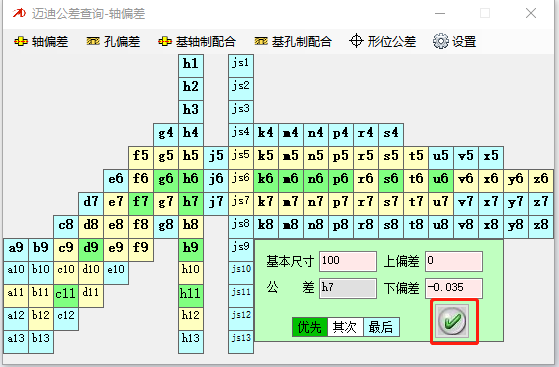
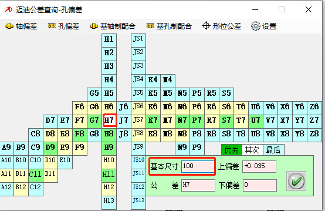
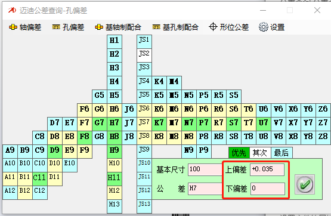
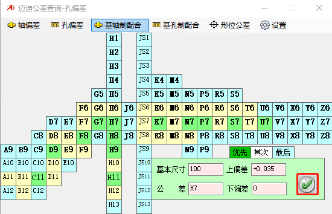
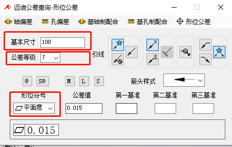
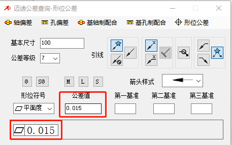

# 公差查询

公差查询程序是提取大工程师中公差查询的插件来进行使用的，主要功能如下：

- 查询轴偏差
- 查询孔偏差
- 查询基轴制配合
- 查询基孔制配合
- 查询形位公差

## 查询轴偏差

1. 打开公差查询页面
2. 输入基本尺寸，选择需要的公差

3. 在上下偏差中可显示对应的值

4. 在工程图尺寸标注页面可选中尺寸，点击打勾可填入对应的公差

## 查询孔偏差

1. 打开公差查询页面
2. 输入基本尺寸，选择需要的公差

3. 在上下偏差中可显示对应的值

4. 在工程图尺寸标注页面可选中尺寸，点击打勾可填入对应的公差

## 查询基轴制配合

与查询轴偏差类似，请查看轴偏差查询

## 查询基孔制配合

与查询孔偏差类似，请查看孔偏差查询

## 查询形位公差

1. 打开公差查询页面
2. 输入基本尺寸，选择公差等级及对应的形位公差

3. 显示公差值及对应的符号

4. 在工程图尺寸可拉取出形位公差符号