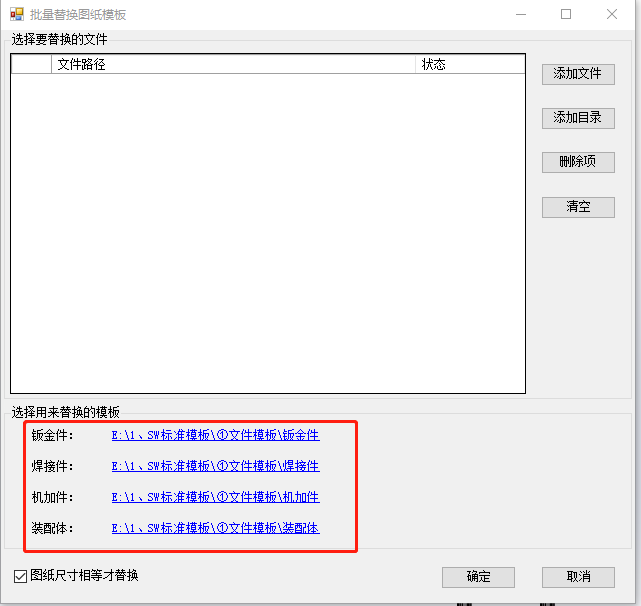
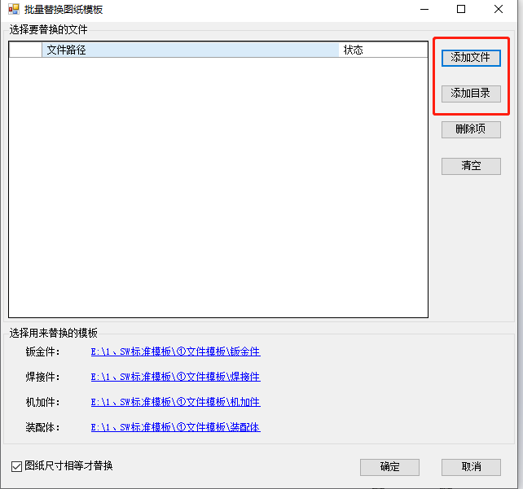
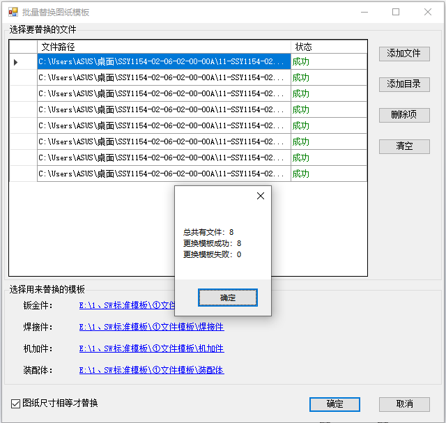

# 工程图模板替换

工程图模板替换可根据类别来选择对应的文件模板进行替换操作，初次使用需要检查模板路径是否正确，目前已实现功能如下：

- 根据类别自动选择文件模板
- 替换状态显示
- 替换完成显示数量
- 模板位置记忆功能

## 使用方法

1. 打开批量替换图纸模板窗口，检查模板位置是否为本电脑模板存放的位置（位置不对需要进行选择）

2. 添加文件，也可添加整个目录（自动筛选出工程图文件）

3. 点击确定，进行模板替换，替换状态可查看状态列

