# 批量改名

批量改名主要用于批量对SolidWorks文件进行批量重命名，且可保持与工程图的关联关系，目前已经实现的功能如下：

- 批量更改文件名
- 查找替换
- 自定义筛选
- 自动按顺序编号
- 更改文件属性
- 选中行时在数模中高亮对应文件
- 双击打开零部件
- 双击打开工程图

## 批量更改文件名

1. 在SolidWorks中打开装配体模型，建议以还原模式打开。

2. 点击连接SW（可设置属性读取方式与采购件读取方式）

   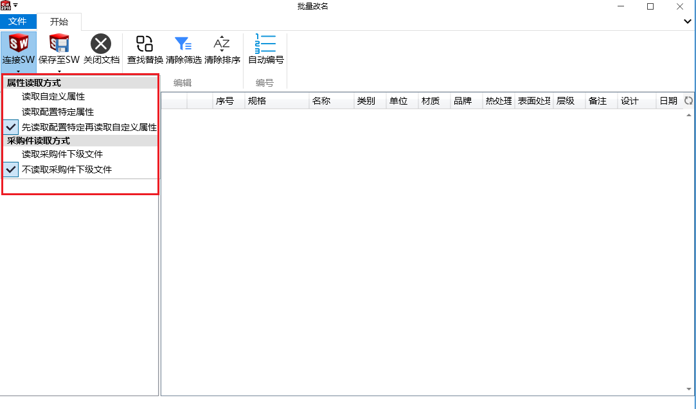

3. 连接完成后在左下角可显示读取的耗时及文件的数量（压缩文件不进行读取）

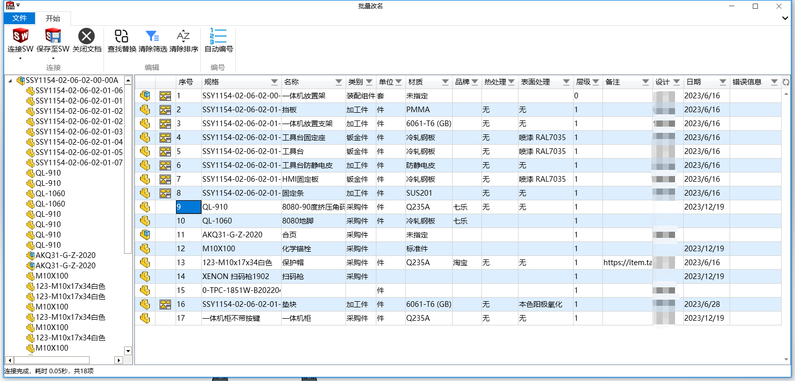

4. 可在表格中更改文件名（规格列）、名称、类别、单位、品牌、热处理、表面处理、备注、设计、日期列的值（规格存在同名或者表格中存在相同行会弹窗提示）

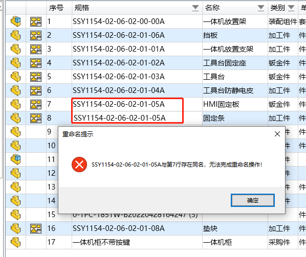

5. 更改后的值显示为绿色

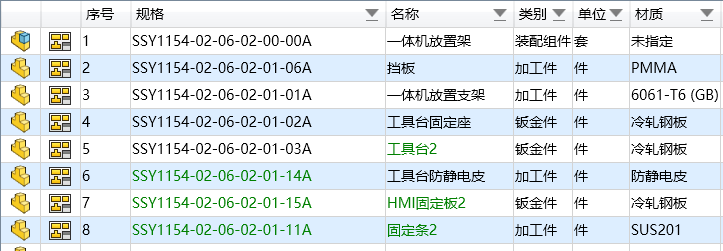

6. 更改后需点击保存至SW才会进行修改保存操作（属性值有进行更改的需要设置属性保存方式，默认为不保存属性值）

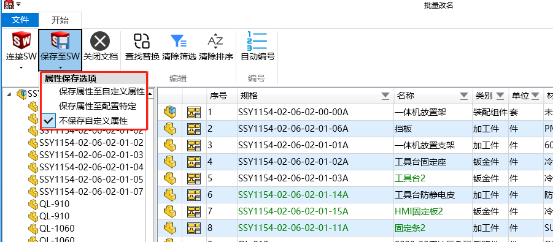

## 查找替换

1. 点击查找替换，输入需要查找替换的值

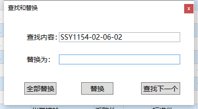

2. 单个替换需要先点击查找下一个再进行替换操作（全部替换无需此操作）
3. 全部替换可将文件名中包含查找内容的都替换为需要的字符（可用于替换前后缀）

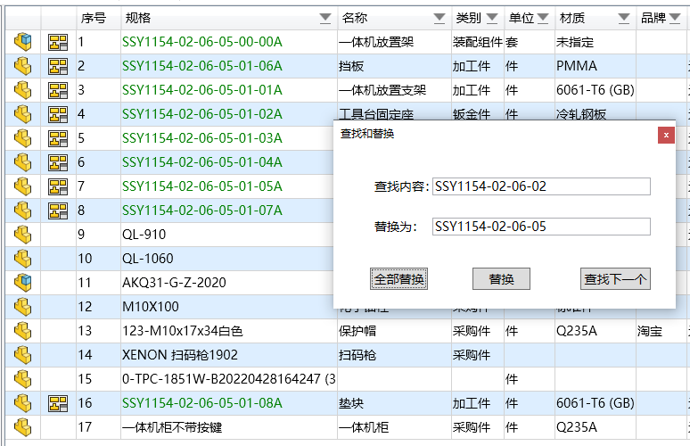

## 自定义筛选

在每一列的表头可下拉进行筛选操作（带倒三角的列都可进行筛选）

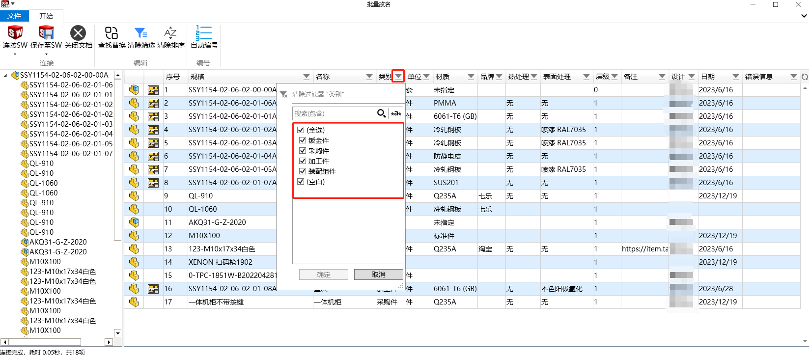

## 自动按顺序编号

只需输入顶层装配体的图号即可（需要更改子部件的需要带00）

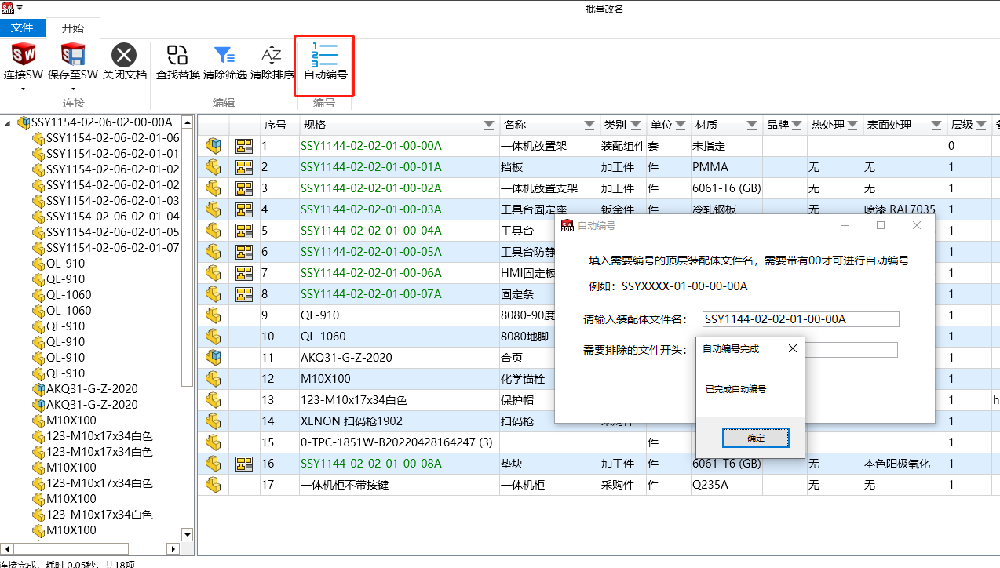

## 更改文件属性

与更改文件名类似，在保存时需要设置属性保存选项（默认不保存属性值）

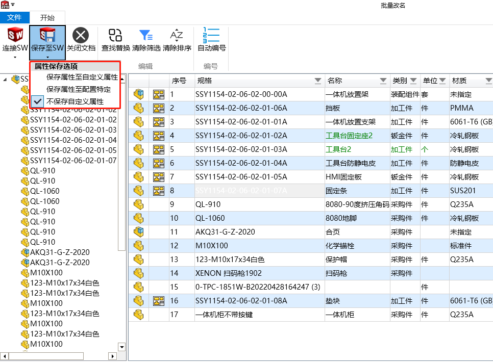

## 选中行时在数模中高亮对应文件

选中时可在数模中高亮显示，在设计树中也会对应高亮显示（仅限顶层文件）

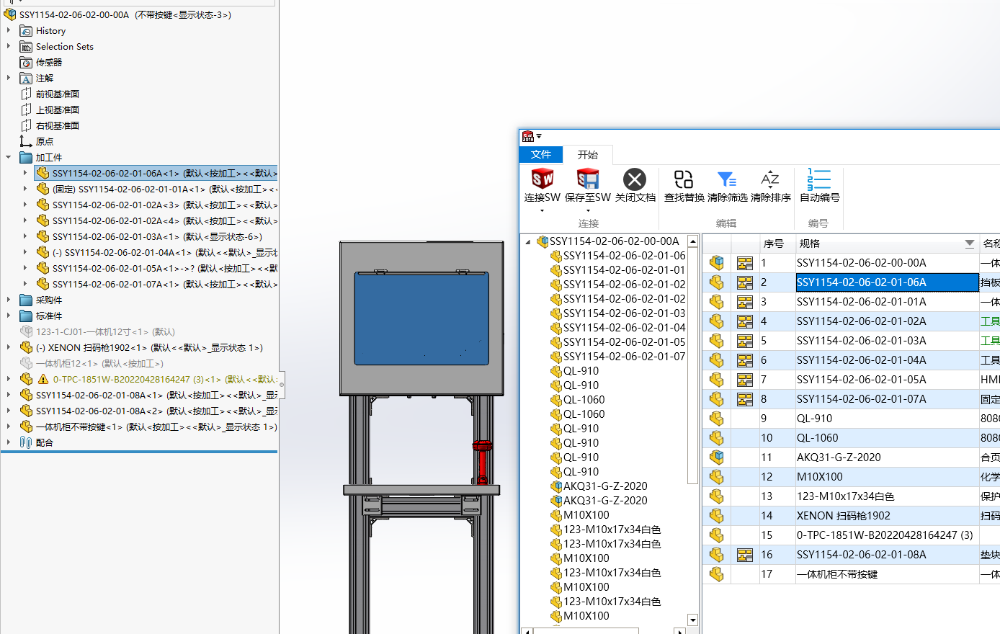

## 双击打开零部件

双击零部件图标处可打开对应的文件

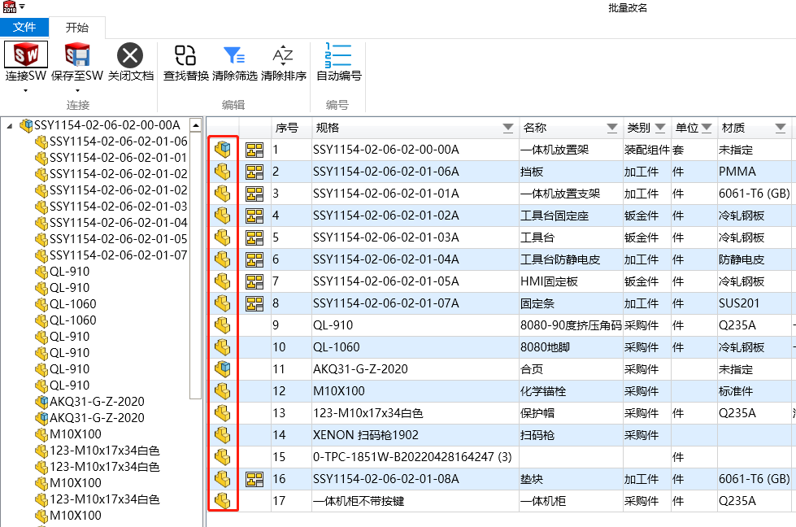

## 双击打开工程图

带工程图的图标可双击进行打开

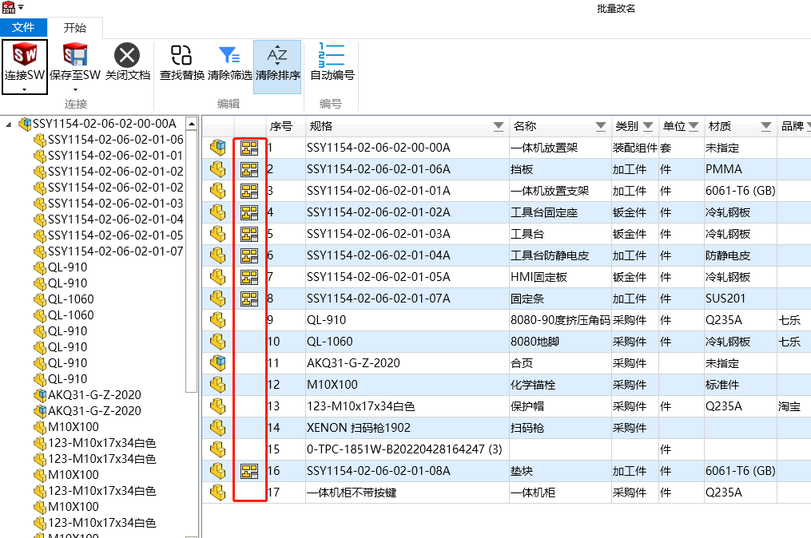
