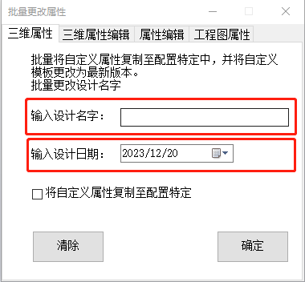

# 批量更改属性

批量更改属性主要是批量设置文件的属性，目前实现的功能如下：

- 批量将自定义属性复制至配置特定
- 将自定义属性模板更换为最新模板（需要保证使用的是公司标准化属性模板）
- 批量设置设计名字及设计日期
- 批量清除物料编码
- 批量将配置特定中规格链接到文件名
- 批量清除自定义属性内容
- 批量替换属性中表面处理的值
- 批量更改制图名字及日期

## 批量将自定义属性复制至配置特定使用说明

1. 打开需要更改属性的装配体
2. 打开批量更改属性页面

3. 勾选将自定义属性复制至配置特定

4. 点击确定和清除都会执行程序

   > 点击确定则需要输入设置设计名字及日期，在复制过程中可批量设置设计名字及日期
   >
   > 点击清除则不设置设计名字及日期，在复制过程中清空设计名字及日期

5. 在设置过程中会自动替换自定义属性模板

   > 自动将自定义属性模板替换为公司标准化最新属性模板

## 批量设置设计名字及日期使用说明

1. 打开需要更改属性的装配体
2. 打开批量更改属性页面

3. 输入设计名字及日期

4. 点击确定即可批量设置装配体内所有文件的设计名字及日期

> 清除按钮主要在标准化中使用，可批量清除设计名字及日期

## 批量清除物料编码

1. 打开需要更改属性的装配体
2. 打开批量更改属性页面-三维属性编辑页面

3. 勾选批量清除物料编码

4. 点击确定即可，完成会进行弹窗提示

## 批量将配置特定中规格链接到文件名

1. 打开需要更改属性的装配体
2. 打开批量更改属性页面-三维属性编辑页面

3. 勾选将配置特定中规格链接到文件名

4. 点击确定即可，完成会进行弹窗提示

## 批量清除自定义属性内容

1. 打开需要更改属性的装配体
2. 打开批量更改属性页面-三维属性编辑页面

3. 勾选将配置特定中规格链接到文件名

4. 点击确定即可，完成会进行弹窗提示

## 批量替换属性中表面处理的值

1. 打开需要更改属性的装配体
2. 打开批量更改属性页面-属性编辑页面

3. 在表面处理原值处填入需要更改的值，在替换为处填写更改后的值

4. 点击确定即可，替换完成会进行弹窗提示

## 批量更改制图名字及日期

1. 打开需要更改属性的装配体
2. 打开批量更改属性页面-工程图属性编辑页面

3. 输入制图名字及日期，选择需要更改文件的路径

> 默认文件路径为当前文件的路径

4. 点击设置即可开始修改，替换完成会进行弹窗提示

> 清除按钮主要在标准化中使用，可批量清除制图名字及日期