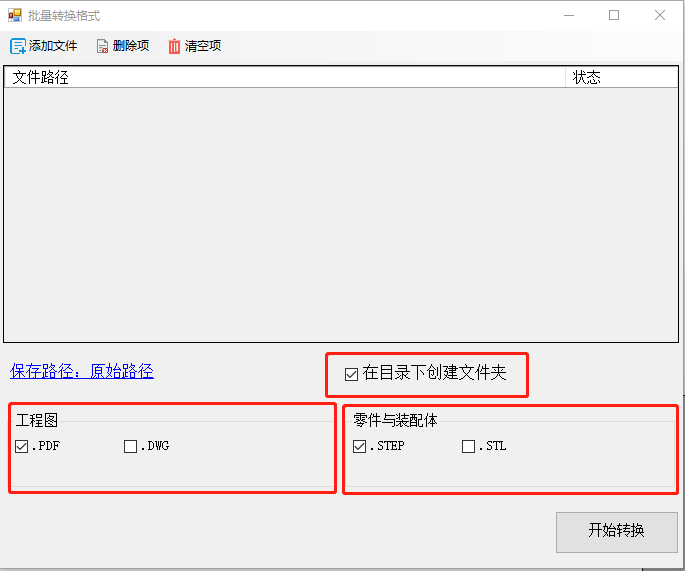
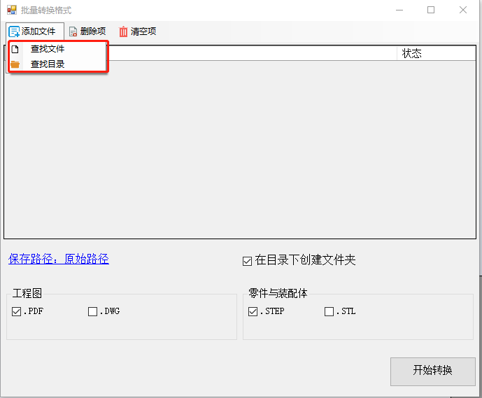
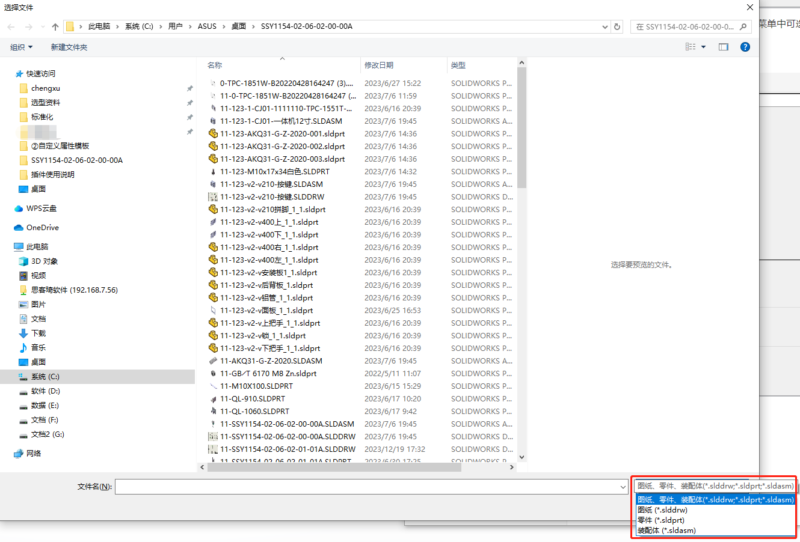
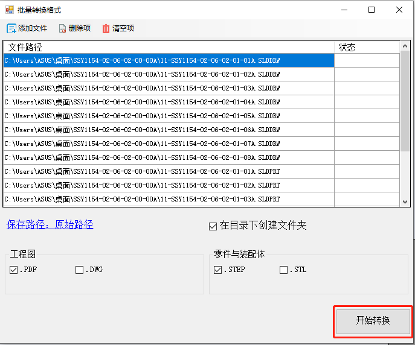
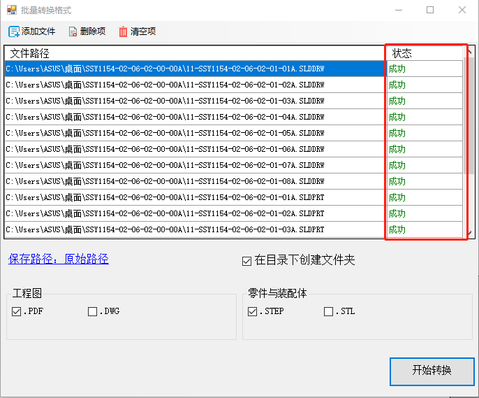
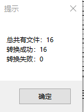
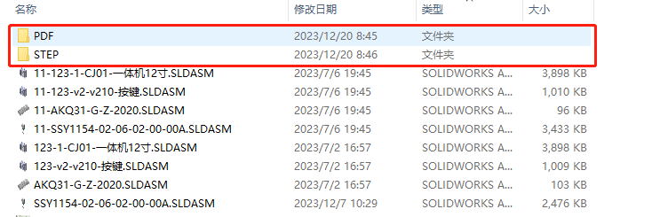

# 批量转换零件与图纸

批量转换零件与图纸主要用于在下单时转换PDF与转换STEP使用，目前实现的功能如下：

- 将工程图转换PDF
- 将工程图转换DWG
- 将零件与装配体转换STEP
- 将零件与装配体转换STL
- 在保存目录下创建对应的文件夹

## 使用说明

1. 打开批量转换零件与图纸窗口，默认勾选工程图转换PDF，零件与装配体转换STEP，且在保存文件夹下自动创建对应的文件夹，可自行对转换设置进行选择

2. 将鼠标移至左上添加文件处，在下拉菜单中可选择添加文件与添加目录（添加目录则会添加目录下所有的工程图、零件、装配体文件）

3. 添加文件可快速筛选文件的后缀

4. 文件添加后，设置也确认无误，点击下方开始转换

5. 转换时可在状态列显示转换失败或者成功

6. 转换完成后会弹窗提示文件数量及转换成功或失败的数量

7. 打开文件夹可看到转换类型的文件夹

