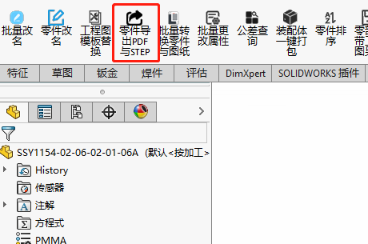
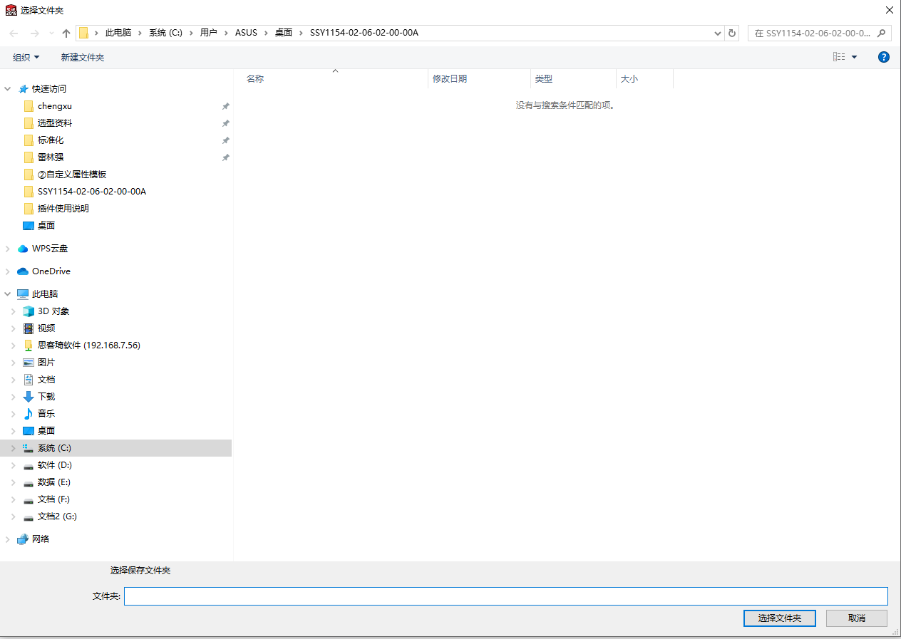
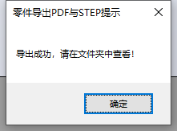

# 零件导出PDF与STEP

零件导出PDF与STEP功能主要是用在零件改修时，可直接将数模导出为STEP，工程图导出为PDF，节省时间，目前实现的功能如下：

- 三维数模导出STEP
- 工程图导出PDF
- 自动寻找数模对应的工程图文件

## 使用方法

1. 打开要导出的零件，点击**零件导出PDF与STEP**功能

2. 选择需要保存的文件夹路径

3. 自动进行保存，保存完成后弹窗提醒

