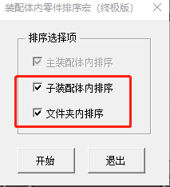
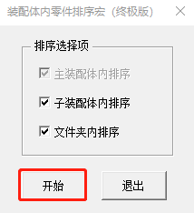

# 零件排序

零件排序功能采用的是宏命令的方式运行，个别电脑可能无法运行，请等待后续的适配，目前已实现的功能如下：

- 对顶级装配体设计树进行排序
- 对文件夹进行排序
- 对子装配体进行排序

## 使用说明

1. 打开需要排序的装配体（需要以还原的方式打开）
2. 打开零件排序页面，可根据需要进行取消勾选子装配体内排序与文件夹排序

3. 点击开始即可，需要等待一会才可排序完成（装配体越大，需要花费的时间越长）

