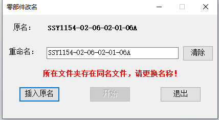
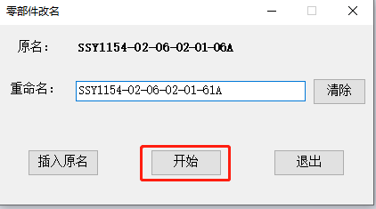

# 零件改名

零件主要用于对SolidWorks设计树中的文件进行重命名，且可保持与工程图的关联关系，目前已经实现的功能如下：

- 插入原名
- 检测文件夹中是否存在同名文件
- 检测文件命名是否规范
- 保持工程图关联

## 使用方法

1. 在设计树中选中需要改名的文件，打开零件改名窗口（也可以先打开窗口再选中文件），在原名处会显示当前选中文件的文件名，可根据选中的文件进行变化（无需关闭窗口）

2. 填写需要更改的文件名（文件夹中存在同名或者命名不规范会进行提示，且无法重命名）

3. 点击开始即可进行重命名（自动对同名的工程图也进行命名，保持关联关系）

4. 完成改名。