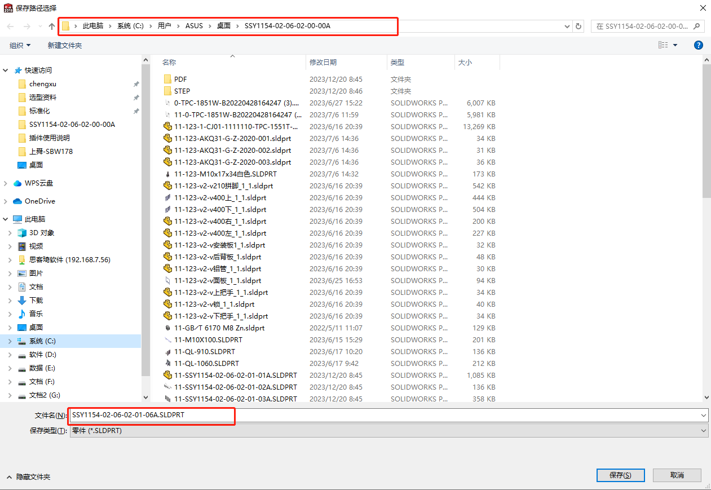
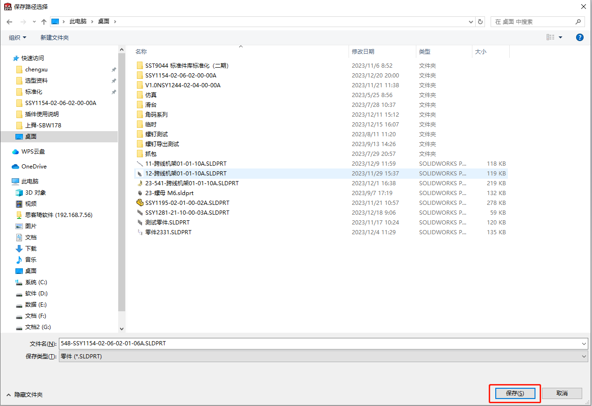
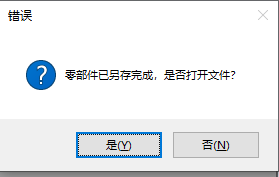

# 零部件带工程图另存

零部件带工程图另存功能可用在零件或装配体相似且带有工程图的文件中使用，节省设计及出图的时间，目前已实现的功能如下：

- 自定义保存位置
- 保持工程图关联关系
- 另存完成后可打开文件

## 使用方法

1. 打开需要另存的零件或装配体
2. 点击零部件带工程图另存
3. 更改保存路径及文件名

4. 点击保存即可

5. 另存完成后提示是否打开文件，可自行选择是和否

